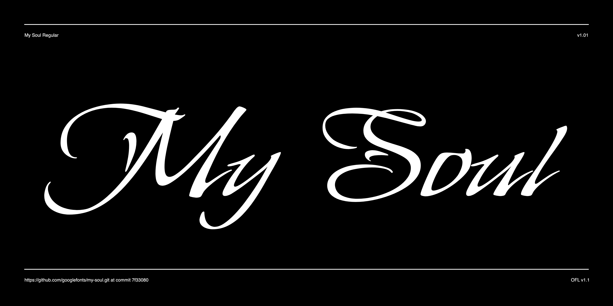

# My Soul

Inspired by the lettering popular in the northwest United States in the 1980s, My Soul is a flat pen calligraphic style with capital forms that have been subtly embellished. It's robust weight holds up well at reduced sizes, but be careful as the embellishments may cause a loss of legibility at such sizes.



## Building the Fonts

The font is built using fontmake and gftools post processing script. Tools are all python based, so it must be previously installed.

To install all the Python tools into a virtualenv, do the following:

From terminal:

```

cd your/local/project/directory

#once in the project folder create a virtual environment. 
This step has to be done just once, the first time:

python3 -m venv venv

#activate the virtual environment

source venv/bin/activate

#install the required dependencies

pip install -r requirements.txt

```

Then run the this command:

```
cd sources
gftools builder config.yml
```
